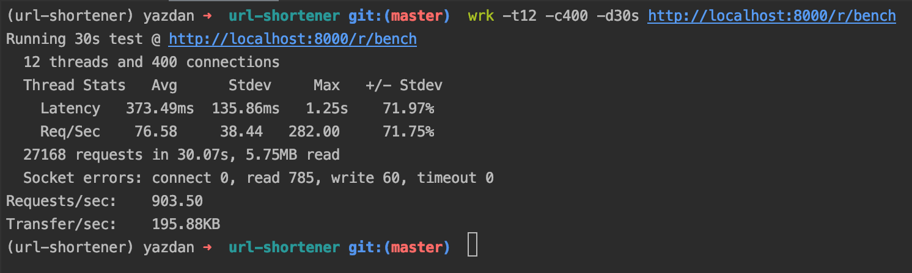
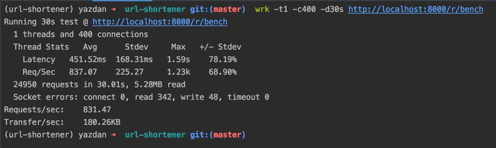

# URL-Shortener
Yektanet

- [Django](https://github.com/django/django)
- [PostgreSQL](https://www.postgresql.org)
- [Django-user-agents](https://github.com/selwin/django-user_agents)
- [Django-ipware](https://github.com/un33k/django-ipware)

# Setup
create database_settings.py, local_settings.py like EXAMPLES.

````
database_settings.py
------------------------

# Database
# https://docs.djangoproject.com/en/2.2/ref/settings/#databases

DATABASES = {
    'default': {
        'ENGINE': 'django.db.backends.postgresql',
        'NAME': 'yektanet',
        'USER': 'postgres',
        'PASSWORD': '*********',
        'HOST': 'localhost',
    }
}

````

````
local_settings.py
------------------------

# Quick-start development settings - unsuitable for production
# See https://docs.djangoproject.com/en/3.0/howto/deployment/checklist/

# SECURITY WARNING: keep the secret key used in production secret!
SECRET_KEY = '=e=ths%d69zf_nikl$8$7Qf&*26k=q)_t5iya(n-f*@$afj^29'

# SECURITY WARNING: don't run with debug turned on in production!
DEBUG = False

ALLOWED_HOSTS = ['localhost', '127.0.0.1']

````

then create a virtual environment, and active it.

````
virtualenv -p python3 .venv
````
````
source .venv/bin/activate
````
> after activate you should see (.venv) !

now install requirements via
````
pip install -r requirements.txt
````
and migrate database
````
python manage.py migrate
````
and finally, run =)
````
python manage.py runserver
````


# Benchmark




> via [wrk](https://github.com/wg/wrk)

# Notice
This project is a step of the Yektanet job interview.
you can find the [documents](docs/Software%20Engineer%20Interview%20Task.pdf) in the docs directory.

